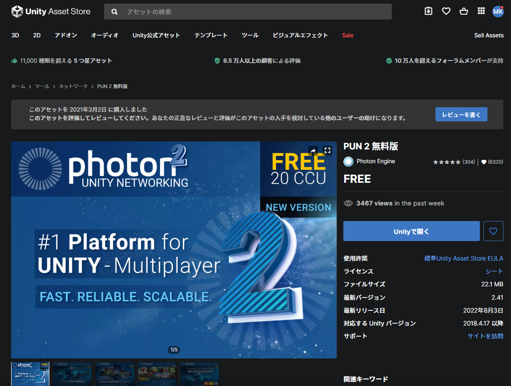

# ASA_Human_View

ROSから受け取った人物行動情報や物体情報をAzure Spatial Anchorを用いて複数のHoloLens2ユーザーに提示するサービスインターフェース

## Enviroments

- Unity 2020.3.12f
- HoloLens 2

## Required

**Shigure Projects**

Shigureに関する情報 : https://github.com/Rits-Interaction-Laboratory/shigure_core/wiki

カメラ映像
- [rs_ros2_python](https://github.com/Rits-Interaction-Laboratory/rs_ros2_python)

人物骨格推定
- [openpose_ros2](https://github.com/Rits-Interaction-Laboratory/openpose_ros2)
    - [openpose_ros2_docker](https://github.com/Rits-Interaction-Laboratory/openpose_ros2_docker)

人物領域推定
- [people_detection_ros2](https://github.com/Rits-Interaction-Laboratory/people_detection_ros2)
  - [people_detection_ros2_docker(本リポジトリ)](https://github.com/Rits-Interaction-Laboratory/people_detection_ros2_docker)

イベント検出
- [shigure_core](https://github.com/Rits-Interaction-Laboratory/shigure_core)

**Asset Store**

- PUN2 Free
    

      
インストール方法

    Unityを開いて、Window > Asset Store > PUN 2 無料版をインストール

    
    

**Package Manager**

- [Mixed Reality Toolkiit](https://github.com/microsoft/MixedRealityLearning/releases)
  - Mixed Reality OpenXR Plugin (1.4.0)
  - Mixed Reality Toolkit Foundation(2.7.3)
  - Mixed Reality Toolkit Assets(2.7.3)
- 以下のパッケージはこちらのページでimport できる　(https://github.com/microsoft/MixedRealityLearning/releases)
  - Multi-User Capabilities (v2.7.2)
  - Getting Started (v2.7.2)
  - Azure Spatial Anchors (v2.7.2)
    
    Azure Spatial AnchorsチュートリアルのAnchorModuleScriptは、asset直下に配置しているスクリプトNewAnchorModuleScriptと置き換えて使用してください

- Azure Spatial Anchors
  - Azure Spatial Anchors SDK Core(2.12.0)
  - Azure Spatial Anchors SDK for Windows(2.12.0)

- Unity 日本語フォント　
https://www.midnightunity.net/textmeshpro-japanese-font/
  参照
  - NotoSanJP-Regularをインストール

- Consolation(1.3.1)
